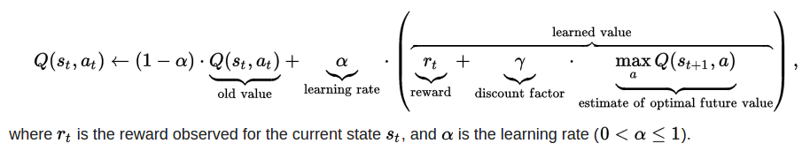
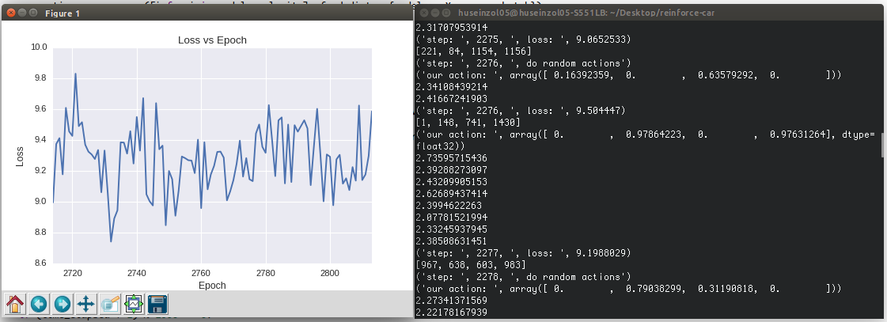
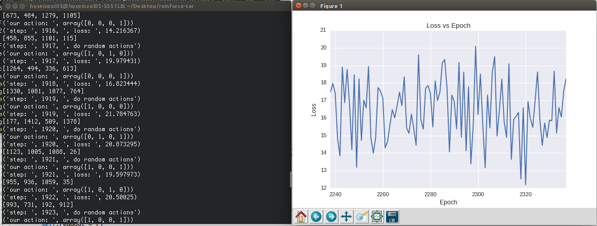

# RC-Car-Reinforcement-Learning
Deep-Q Reinforcement learning to train a RC car to become self-drive using 4 ultrasonic sensors.

Use Tensorflow on 2 hidden layers with 128 size layer each on Deep Feed-Forward Neural Network.

Based on Bellman Policy Equation. Simple fuzzy, if not accident, apply this equation on our sensor distances.


If accident, take exactly our sensor distances.

Support Digital and Analog RC Engines, you might need to check in setting.py
```python
ACTIONS = 4
INITIAL_MEMORY = 4
GAMMA = 0.99
OBSERVE = 1000
EXPLORE = 20000
FINAL_EPSILON = 0.001
INITIAL_EPSILON = 0.7
REPLAY_MEMORY_SIZE = 50000
BATCH = 32
FRAME_PER_ACTION = 1
USE_ANALOG = False
```

Right now my hardware are:
1. Raspberry PI 3 (1 unit)
2. REKA Board (1 unit)
3. ultrasonic sensors (4 units) placed on infront, back, left and right
4. enough jump wires
5. breadboards
6. RC Car (can use both digital and analog)

## How it works
1. Raspberry PI 3 read serial port from REKA board
2. Raspberry PI 3 will broadcast sensor values to our deep neural networks in our server (can be laptop or server)
3. Our server will return output value which are {left, right, forward, backward}
4. Keep doing this until fit enough

### Analog outputs on simulation


### Digital outputs on simulation

