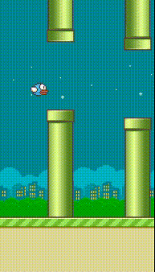
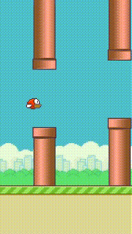
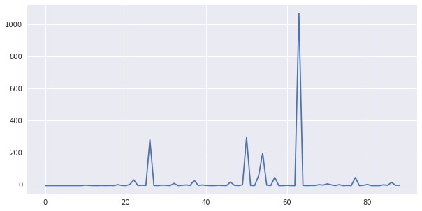
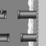

## Welcome to Flap-flap-flap!

Professional flap-flap-flap

Our flap-flap-flap on training..

Reward graph on deep evolution reward strategies using features

Reward graph on deep-q evolution strategies using features

Reward graph on deep-q-learning trained using features

Reward graph on deep-q-learning trained using frames

### Feature values
our flap-flap-flap trained on:
1. player y position.
2. players velocity.
3. next pipe distance to player
4. next pipe top y position
5. next pipe bottom y position
6. next next pipe distance to player
7. next next pipe top y position
8. next next pipe bottom y position

### frames based
our flap-flap-flap trained on greyscale images

